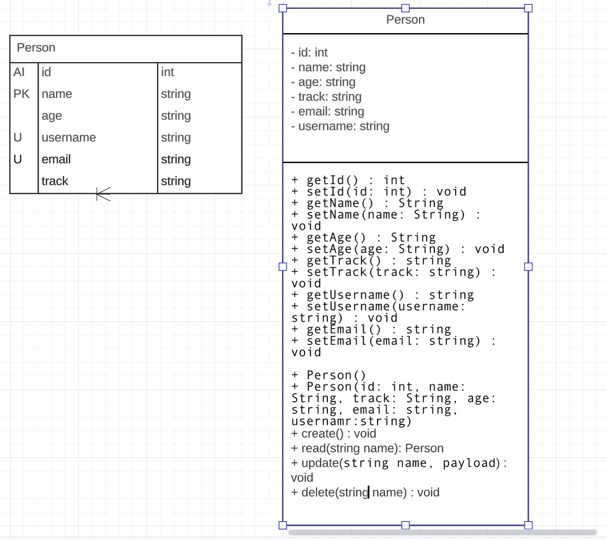

#  ***HNG BACKEND TASK API V1***
## Language and frameworks
- Nodejs (12.x)
- MongoDB
- Expressjs
## Endpoints
- Users [/users]
  1. Create User [POST][/]
  2. Read [GET][/:user_id]
  3. Update [PUT][/:user_id]
  4. Delete [DELETE][/:user_id]

## TASKS
- [x] Create user
- [x] Get user
- [x] Modify User
- [x] Delete User

## Links
- [Home](https://nck-test.herokuapp.com)
- [Api v1 Base URl](https://nck-test.herokuapp.com/api/v1)
- [Health check](https://nck-test.herokuapp.com/healthcheck)
  

## Installation instructions
- Download the code from github (Main branch)
- npm i to install dependencies
- npm start to  start application

## Environment Variables
- NODE_ENV
- APP_NAME
- PORT
- MONGODB_URL
  

***HAPPY CODING***
:grin:
:rocket: :rocket: :rocket: :rocket: :rocket: :rocket:
